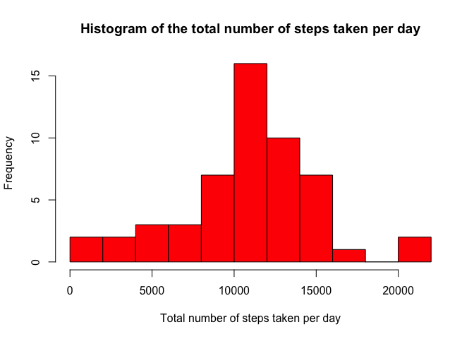
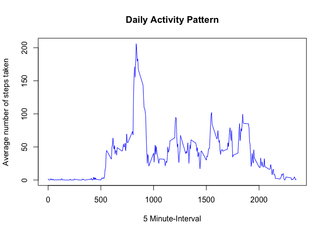
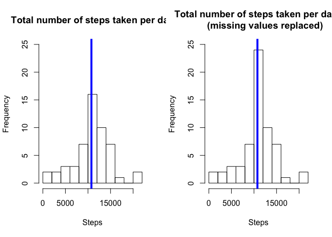

# Reproducible Research: Peer Assessment 1


## Loading and preprocessing the data
We need to first of all unzip the data since it is stored in a compressed format. So we will load the uncompressed data and store it as activity.data


```r
filename <- unzip("activity.zip")
activity.data <- read.csv(filename, stringsAsFactors = FALSE)
str(activity.data)
```

```
## 'data.frame':	17568 obs. of  3 variables:
##  $ steps   : int  NA NA NA NA NA NA NA NA NA NA ...
##  $ date    : chr  "2012-10-01" "2012-10-01" "2012-10-01" "2012-10-01" ...
##  $ interval: int  0 5 10 15 20 25 30 35 40 45 ...
```

The date is formatted as a characters in the dataset and we need to convert it to a date format.


```r
activity.data$date <- as.Date(activity.data$date)
str(activity.data)
```

```
## 'data.frame':	17568 obs. of  3 variables:
##  $ steps   : int  NA NA NA NA NA NA NA NA NA NA ...
##  $ date    : Date, format: "2012-10-01" "2012-10-01" ...
##  $ interval: int  0 5 10 15 20 25 30 35 40 45 ...
```


```r
missing.data<-sum(is.na(activity.data$steps))
```

We can also see that there 2304 missing values in the dataset.


## What is mean total number of steps taken per day?

We will exclude the missing values in the determination of the total mean number of steps taken per day. So we create a new dataset with the missing values removed.


```r
activity.rm<-activity.data[which(!is.na(activity.data$steps)),]
```
We will aggregate the number of steps taken for each day since the number of steps is taken for every 5 minutes.
 

```r
actday<-tapply(activity.rm$steps, activity.rm$date, sum)
```

So we plot a histogram of the total number of steps taken per day


```r
hist(actday,breaks = 12, col = "red", main = "Histogram of the total number of steps taken per day", xlab = "Total number of steps taken per day")
```

 

 The mean number of steps taken across all the days is:
 

```r
m.old<-mean(actday)
```
and the median total number of steps taken across all the days is:


```r
md.old<-median(actday)
```


## What is the average daily activity pattern?

We calculate the average number of steps taken for each time interval across all days to get the daily activity pattern.


```r
dailyact<-tapply(activity.rm$steps, activity.rm$interval, mean)
```

We then plot a time series of the 5-minutes interval on the x-axis and the average number of steps averaged across all days on the y-axis.


```r
plot(y = dailyact, x = names(dailyact), type = "l", xlab = "5 Minute-Interval", 
     main = "Daily Activity Pattern", ylab = "Average number of steps taken", col ="blue")
```

 

So the interval with the maximum average number of steps is:


```r
dailyact[dailyact==max(dailyact)]
```

```
##      835 
## 206.1698
```

## Imputing missing values

The total number of missing values (NA) in the dataset is:


```r
sum(is.na(activity.data))
```

```
## [1] 2304
```

We fill missing values using the mean of the 5-minute interval.


```r
activity.new <- activity.data
activity.new[which(is.na(activity.new$steps)),1]<-
  dailyact[as.character(activity.new[which(is.na(activity.new$steps)),3])]
head(activity.new)
```

```
##       steps       date interval
## 1 1.7169811 2012-10-01        0
## 2 0.3396226 2012-10-01        5
## 3 0.1320755 2012-10-01       10
## 4 0.1509434 2012-10-01       15
## 5 0.0754717 2012-10-01       20
## 6 2.0943396 2012-10-01       25
```

There are zero (0) NA in the new dataset as shown below


```r
sum(is.na(activity.new))
```

```
## [1] 0
```
We will again plot the histograms of the total number of steps taken each day, for the new data set and the old data set and compare the results.


```r
actday.new<-tapply(activity.new$steps, activity.new$date, sum)

par(mfrow=c(1,2))
hist(actday,breaks = 12, main = "Total number of steps taken per day", xlab = "Steps"
     , ylim =c(0, 25))
abline(v = median(actday), col = 4, lwd = 4)
hist(actday.new,breaks = 12, main = "Total number of steps taken per day  
     (missing values replaced)", xlab = "Steps",
     ylim =c(0, 25))
abline(v = median(actday.new), col = 4, lwd = 4)
```

 


The mean number of steps of the new dataset is 1.0766189\times 10^{4} and the old dataset is 1.0766189\times 10^{4}

The median number of steps of the new dataset is 1.0766189\times 10^{4} and the old dataset is 10765.

As seen from the above, the effect of the imputation is minimal.

## Are there differences in activity patterns between weekdays and weekends?

We create a new factor variable which indicate a weekday or weekend


```r
activity.new$wd<-weekdays(activity.new$date)
activity.new$fwd<- as.factor(c("weekend", "weekday"))
activity.new[activity.new$wd == "Sunday" | activity.new$wd == "Saturday" ,5]<- factor("weekend")
activity.new[!(activity.new$wd == "Sunday" | activity.new$wd == "Saturday"),5 ]<- factor("weekday")


act_new_we <- subset(activity.new, fwd == "weekend") 
act_new_wd <- subset(activity.new, fwd == "weekday") 
dailyact_we<-tapply(act_new_we$steps, act_new_we$interval, mean)
dailyact_wd<-tapply(act_new_wd$steps, act_new_wd$interval, mean)
```

We then plot a  graph of the number of steps for both weekdays and weekends as shown below:


```r
par(mfrow=c(2,1))
plot(y = dailyact_wd, x = names(dailyact_wd), type = "l", xlab = "5-Minute Interval", 
     main = "Daily Activity Pattern on Weekdays", ylab = "Average number of steps", 
     ylim =c(0, 250))
plot(y = dailyact_we, x = names(dailyact_we), type = "l", xlab = "5-Minute Interval", 
     main = "Daily Activity Pattern on Weekends", ylab = "Average number of steps", 
     ylim =c(0, 250))
```

 

From the plots, it is clear that there is a difference between the activity patterns for weekday and weekend. There are more activities in the early morning hours of weekday as compared to weekend, and the maximum number of steps taken happens in the weekday. After the morning activities, the weekday activity is significant reduced as compared to that of the weekend.
